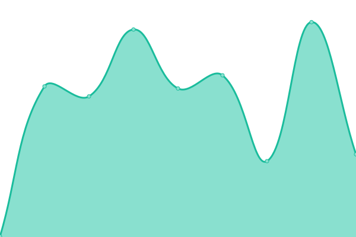
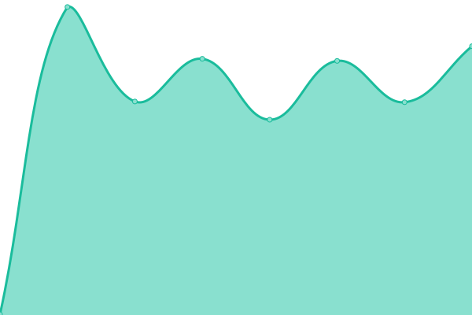

# [📈 Live Status](https://parcoApp.github.io/status): <!--live status--> **🟧 Partial outage**

This repository contains the open-source uptime monitor and status page for [parcoApp](https://parcoApp.github.io/status), powered by [Upptime](https://github.com/upptime/upptime).

With [Upptime](https://upptime.js.org), you can get your own unlimited and free uptime monitor and status page, powered entirely by a GitHub repository. We use [Issues](https://github.com/parcoApp/status/issues) as incident reports, [Actions](https://github.com/parcoApp/status/actions) as uptime monitors, and [Pages](https://parcoApp.github.io/status) for the status page.

<!--start: status pages-->
<!-- This summary is generated by Upptime (https://github.com/upptime/upptime) -->
<!-- Do not edit this manually, your changes will be overwritten -->
<!-- prettier-ignore -->
| URL | Status | History | Response Time | Uptime |
| --- | ------ | ------- | ------------- | ------ |
|  [Kraken](https://kraken.parcoapp.com) | 🟩 Up | [kraken.yml](https://github.com/ParcoApp/status/commits/HEAD/history/kraken.yml) | 

 324ms
     
 | 

<a href="https://parcoApp.github.io/status/history/kraken">100.00%</a>
    

|  [Ghostbuster](https://parcoapp-apis-ghostbuster.echo.parcoapp.com) | 🟩 Up | [ghostbuster.yml](https://github.com/ParcoApp/status/commits/HEAD/history/ghostbuster.yml) | 

 328ms
     
 | 

<a href="https://parcoApp.github.io/status/history/ghostbuster">100.00%</a>
    

|  [Tesseract](https://parcoapp-apis-tesseract.echo.parcoapp.com) | 🟩 Up | [tesseract.yml](https://github.com/ParcoApp/status/commits/HEAD/history/tesseract.yml) | 

 316ms
     
 | 

<a href="https://parcoApp.github.io/status/history/tesseract">100.00%</a>
    

|  Andares | 🟥 Down | [andares.yml](https://github.com/ParcoApp/status/commits/HEAD/history/andares.yml) | 

 455ms
     
 | 

<a href="https://parcoApp.github.io/status/history/andares">100.00%</a>
    

|  Dostop | 🟩 Up | [dostop.yml](https://github.com/ParcoApp/status/commits/HEAD/history/dostop.yml) | 

 227ms
     
 | 

<a href="https://parcoApp.github.io/status/history/dostop">100.00%</a>
    

<!--end: status pages-->

[**Visit our status website →**](https://parcoApp.github.io/status)

## 📄 License

- Powered by: [Upptime](https://github.com/upptime/upptime)
- Code: [MIT](./LICENSE) © [parcoApp](https://parcoApp.github.io/status)
- Data in the `./history` directory: [Open Database License](https://opendatacommons.org/licenses/odbl/1-0/)
