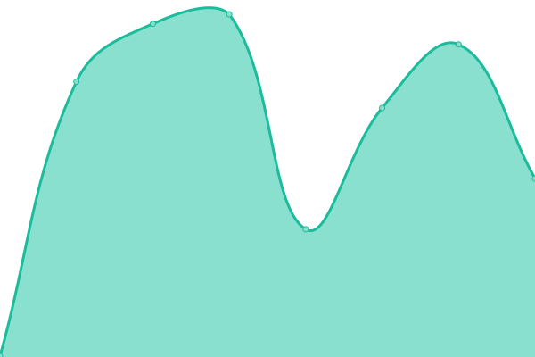
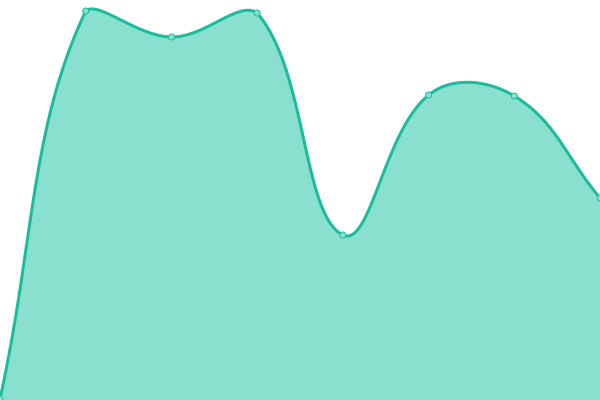
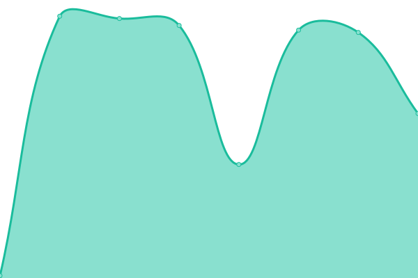
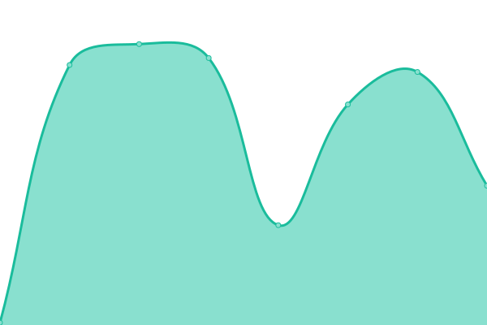
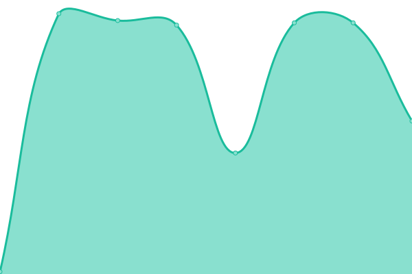
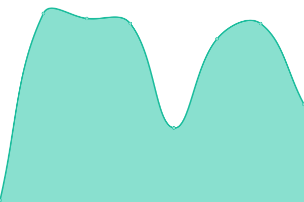

# [📈 Live Status](https://parcoApp.github.io/status): <!--live status--> **🟩 All systems operational**

This repository contains the open-source uptime monitor and status page for [parcoApp](https://parcoApp.github.io/status), powered by [Upptime](https://github.com/upptime/upptime).

With [Upptime](https://upptime.js.org), you can get your own unlimited and free uptime monitor and status page, powered entirely by a GitHub repository. We use [Issues](https://github.com/parcoApp/status/issues) as incident reports, [Actions](https://github.com/parcoApp/status/actions) as uptime monitors, and [Pages](https://parcoApp.github.io/status) for the status page.

<!--start: status pages-->
<!-- This summary is generated by Upptime (https://github.com/upptime/upptime) -->
<!-- Do not edit this manually, your changes will be overwritten -->
<!-- prettier-ignore -->
| URL | Status | History | Response Time | Uptime |
| --- | ------ | ------- | ------------- | ------ |
|  [Kraken](https://kraken.parcoapp.com) | 🟩 Up | [kraken.yml](https://github.com/ParcoApp/status/commits/HEAD/history/kraken.yml) | 

 295ms
     
 | 

<a href="https://parcoApp.github.io/status/history/kraken">100.00%</a>
    

|  [Autotraze - dev](https://net.env.parcoapp.com/autotraze) | 🟩 Up | [autotraze-dev.yml](https://github.com/ParcoApp/status/commits/HEAD/history/autotraze-dev.yml) | 

 344ms
     
 | 

<a href="https://parcoApp.github.io/status/history/autotraze-dev">100.00%</a>
    

|  [Campaigns - dev](https://net.env.parcoapp.com/campaigns) | 🟩 Up | [campaigns-dev.yml](https://github.com/ParcoApp/status/commits/HEAD/history/campaigns-dev.yml) | 

 76ms
     
 | 

<a href="https://parcoApp.github.io/status/history/campaigns-dev">100.00%</a>
    

|  [Carts - dev](https://net.env.parcoapp.com/carts/status) | 🟩 Up | [carts-dev.yml](https://github.com/ParcoApp/status/commits/HEAD/history/carts-dev.yml) | 

 75ms
     
 | 

<a href="https://parcoApp.github.io/status/history/carts-dev">100.00%</a>
    

|  [Hairs - dev](https://net.env.parcoapp.com/hairs) | 🟩 Up | [hairs-dev.yml](https://github.com/ParcoApp/status/commits/HEAD/history/hairs-dev.yml) | 

 74ms
     
 | 

<a href="https://parcoApp.github.io/status/history/hairs-dev">100.00%</a>
    

|  [News - dev](https://net.env.parcoapp.com/news) | 🟩 Up | [news-dev.yml](https://github.com/ParcoApp/status/commits/HEAD/history/news-dev.yml) | 

 76ms
     
 | 

<a href="https://parcoApp.github.io/status/history/news-dev">100.00%</a>
    

|  [Orchestrator - dev](https://net.env.parcoapp.com/orchestrator) | 🟩 Up | [orchestrator-dev.yml](https://github.com/ParcoApp/status/commits/HEAD/history/orchestrator-dev.yml) | 

 77ms
     
 | 

<a href="https://parcoApp.github.io/status/history/orchestrator-dev">100.00%</a>
    

|  [Promocao - dev](https://net.env.parcoapp.com/promocao) | 🟩 Up | [promocao-dev.yml](https://github.com/ParcoApp/status/commits/HEAD/history/promocao-dev.yml) | 

 78ms
     
 | 

<a href="https://parcoApp.github.io/status/history/promocao-dev">100.00%</a>
    

|  [Services - dev](https://net.env.parcoapp.com/services) | 🟩 Up | [services-dev.yml](https://github.com/ParcoApp/status/commits/HEAD/history/services-dev.yml) | 

 75ms
     
 | 

<a href="https://parcoApp.github.io/status/history/services-dev">100.00%</a>
    

|  [Users - dev](https://net.env.parcoapp.com/users/status) | 🟩 Up | [users-dev.yml](https://github.com/ParcoApp/status/commits/HEAD/history/users-dev.yml) | 

 75ms
     
 | 

<a href="https://parcoApp.github.io/status/history/users-dev">100.00%</a>
    

|  [Wallet - dev](https://net.env.parcoapp.com/wallet) | 🟩 Up | [wallet-dev.yml](https://github.com/ParcoApp/status/commits/HEAD/history/wallet-dev.yml) | 

 74ms
     
 | 

<a href="https://parcoApp.github.io/status/history/wallet-dev">100.00%</a>
    

<!--end: status pages-->

[**Visit our status website →**](https://parcoApp.github.io/status)

## 📄 License

- Powered by: [Upptime](https://github.com/upptime/upptime)
- Code: [MIT](./LICENSE) © [parcoApp](https://parcoApp.github.io/status)
- Data in the `./history` directory: [Open Database License](https://opendatacommons.org/licenses/odbl/1-0/)
